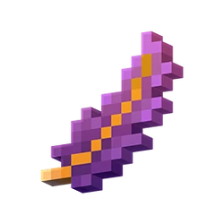

> [!CAUTION]
> This repository is a work in progress and is not complete.

# Feather
An all-in-one plugin library to help Java developers make Bungeecord & Spigot plugins.

## Table of Contents
- [Features](#features)
- [Download](https://git.rainnny.club/Rainnny/Feather/releases)
- [Documentation](https://maven.rainnny.club/javadoc/public/me/braydon/Feather/1.0.0)
- [Support](#support)
- [Contributing](#contributing)
- [Building from Source](#building-from-source)

## Features
- TODO

## Stars

## Support
Looking for support? Join the [**Discord**](https://discord.gg/p9gzFE2bc6) or contact **rainnny7** on Discord.

## Contributing
1. Follow steps for [**building from source**](#building-from-source)
2. Make your changes
3. Make a PR with your changes, following [**these guidelines**](https://github.com/angular/angular/blob/main/CONTRIBUTING.md#commit)

## Building from Source
1. **Clone this repository**: `git clone https://git.rainnny.club/Rainnny/Feather.git && cd Feather`
2. **Build the project**: `mvn package`, output is `./target`